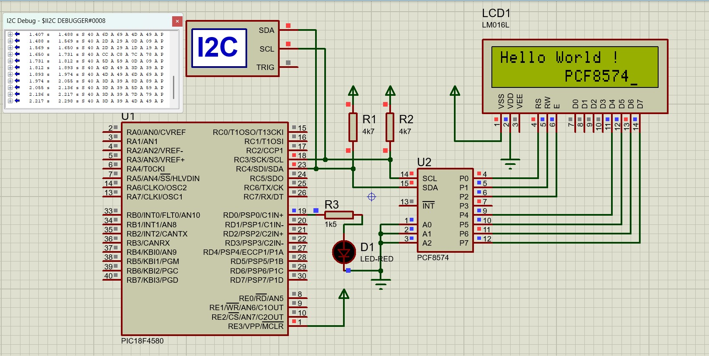

# 📟 LCD Control via I²C (PIC18F4580 + PCF8574)  

This project demonstrates controlling a **16x2 character LCD** using the **PCF8574 I/O expander** over the **I²C protocol** with a **PIC18F4580 microcontroller**. The program is implemented **entirely at the register level**, without relying on external libraries for LCD or I²C.  

---

## 🚀 Features  

- Direct **register-level I²C communication** (no library dependencies).  
- Sends any ASCII string to a **16x2 LCD**.  
- Uses **PCF8574** as an I²C-to-parallel expander for LCD control.  
- Written in **embedded C** for maximum control and learning value.  
 

---

## 🛠️ Hardware Requirements  

- **Microcontroller**: PIC18F4580  
- **LCD**: 16x2 Character LCD (HD44780 compatible)  
- **I²C Expander**: PCF8574 (connected to LCD data + control pins)  
- **Pull-up Resistors**: 4.7kΩ on SDA and SCL lines  
- **Power Supply**: 5V  

📌 **Connections (example):**  
- SDA → RC4 (SDA pin of PIC18F4580)  
- SCL → RC3 (SCL pin of PIC18F4580)  
- PCF8574 → LCD data (D4–D7) + RS, RW, EN pins  

---

## 📂 Project Structure  

```bash
.
├── PIC_I2C_PCF8574.X       # Contains initialization + string send logic
|  ├── main.c
│
├── Proteus Simulation file
└── README.md
```

---

## ⚡ How It Works  

1. **I²C Master Setup**  
   - Configures MSSP (Master Synchronous Serial Port) module in I²C Master mode.  
   - Sets clock frequency for I²C (typically 100kHz).  

2. **PCF8574 Communication**  
   - Sends data to PCF8574 via I²C protocol.  
   - PCF8574 outputs data to LCD pins.  

3. **LCD Initialization**  
   - Configured in **4-bit mode** using PCF8574 lines.  
   - Standard initialization sequence for HD44780 LCD.  

4. **Data Transmission**  
   - Characters/strings sent from PIC → I²C → PCF8574 → LCD.  
   - Any custom string can be displayed.  

---

## 🧩 Future Improvements  

- ✅ Separate LCD & I²C code into **`lcd_i2c.h` / `lcd_i2c.c`**.  
- ✅ Add **functions for cursor movement, custom characters, and scrolling text**.  
- ✅ Expand to **20x4 LCD support**.  
- ✅ Provide **example test cases** (Hello World, counter, sensor values).  

---

## 🖥️ Usage  

1. Clone or download this repo:  
   ```bash
   git clone <https://github.com/Tombstone-1/LCD-Control-via-I2C-PIC18F4580-and-PCF8574.git>

   cd LCD-Control-via-I2C-PIC18F4580-and-PCF8574
   ```
2. Open in **MPLAB X IDE** or your preferred PIC compiler toolchain.  
3. Compile and flash.  
4. Connect hardware and power up → LCD should display the test string.  

---

## 📌 Notes  

- This project is **for learning** register-level programming, so no external drivers are used.  
- Modify `main.c` to send different strings to LCD.  
- Ensure correct I²C Write address of your PCF8574 (according to data sheet).  

---

## Simulation Screenshot

